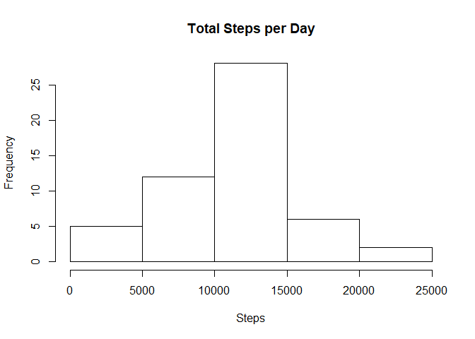
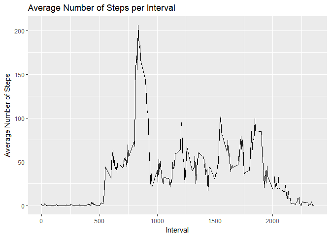
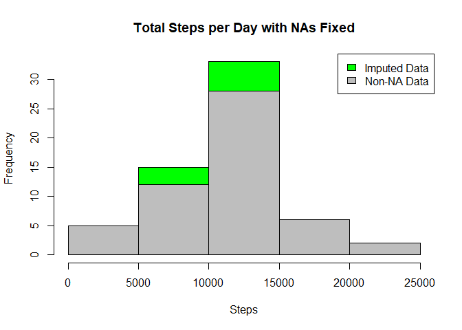
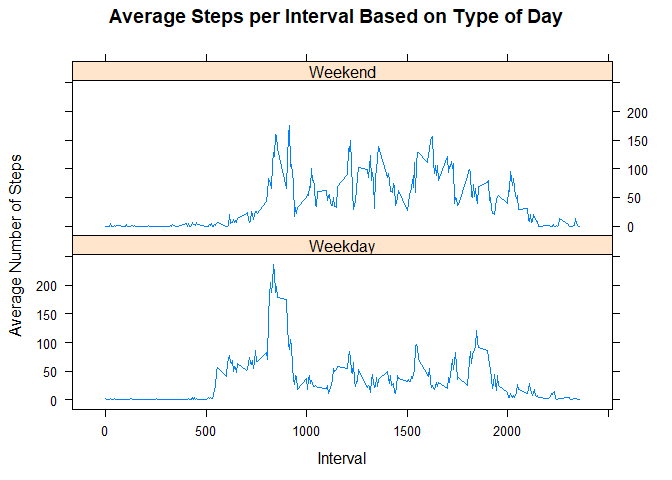

# Reproducible Research: Peer Assessment 1
# Loading and preprocessing the data

## Firstly we are loading the packages ggplot2 and dplyr


```r
library(ggplot2)

library(plyr)

##the data is being loaded 

getwd()
```

```
## [1] "C:/Users/hp/Documents/GitHub/RepData_PeerAssessment1"
```

```r
activity <- read.csv("activity.csv")

##the data is processed here

activity$day <- weekdays(as.Date(activity$date))

activity$DateTime<- as.POSIXct(activity$date, format="%Y-%m-%d")

## NA values are being removed.

clean <- activity[!is.na(activity$steps),]

## total steps per date are being summarized here

sumTable <- aggregate(activity$steps ~ activity$date, FUN=sum )

colnames(sumTable)<- c("Date", "Steps")

##A histogram is being created for total number of steps taken per day

hist(sumTable$Steps, breaks=5, xlab="Steps", main = "Total Steps per Day")
```

<!-- -->

```r
# What is mean total number of steps taken per day?
## mean of steps per day

as.integer(mean(sumTable$Steps))
```

```
## [1] 10766
```

```r
## median of steps per day

as.integer(median(sumTable$Steps))
```

```
## [1] 10765
```

```r
# What is the average daily activity pattern?

## To observe the average daily pattern, average no of steps per interval is firstly taken

intervalTable <- ddply(clean, .(interval), summarize, Avg = mean(steps))

## a line plot for average no of steps taken per interval is drawn

p <- ggplot(intervalTable, aes(x=interval, y=Avg), xlab = "Interval", ylab="Average Number of Steps")


p + geom_line()+xlab("Interval")+ylab("Average Number of Steps")+ggtitle("Average Number of Steps per Interval")
```

<!-- -->

```r
## maximum steps per interval

maxSteps <- max(intervalTable$Avg)

## here which interval out of all has the maximum no of steps taken per interval is found

intervalTable[intervalTable$Avg==maxSteps,1]
```

```
## [1] 835
```

```r
## total no of rows with steps NA is found

nrow(activity[is.na(activity$steps),])
```

```
## [1] 2304
```

```r
## Creating average number of steps per weekday and interval

avgTable <- ddply(clean, .(interval, day), summarize, Avg = mean(steps))

nadata<- activity[is.na(activity$steps),]

newdata<-merge(nadata, avgTable, by=c("interval", "day"))


# Imputing missing values

##Creating a new dataset that is equal to the original dataset but with the missing data filled in.

newdata2<- newdata[,c(6,4,1,2,5)]

colnames(newdata2)<- c("steps", "date", "interval", "day", "DateTime")

mergeData <- rbind(clean, newdata2)

sumTable2 <- aggregate(mergeData$steps ~ mergeData$date, FUN=sum )

colnames(sumTable2)<- c("Date", "Steps")

## mean of steps with NA data

as.integer(mean(sumTable2$Steps))
```

```
## [1] 10821
```

```r
## median of steps with NA

as.integer(median(sumTable2$Steps))
```

```
## [1] 11015
```

```r
##histogram of total steps per day, categorized by data set 

hist(sumTable2$Steps, breaks=5, xlab="Steps", main = "Total Steps per Day with NAs Fixed", col="green")

hist(sumTable$Steps, breaks=5, xlab="Steps", main = "Total Steps per Day with NAs Fixed", col="Grey",add=T)

legend("topright", c("Imputed Data", "Non-NA Data"), fill=c("green", "grey") )
```

<!-- -->

```r
# Are there differences in activity patterns between weekdays and weekends?

## creating a new category based on the days of the week
mergeData$DayCategory <- ifelse(mergeData$day %in% c("Saturday", "Sunday"), "Weekend", "Weekday")


library(lattice) 

#summarize data by interval and type of day

intervalTable2 <- ddply(mergeData, .(interval, DayCategory), summarize, Avg = mean(steps))


xyplot(Avg~interval|DayCategory, data=intervalTable2, type="l",  layout = c(1,2),main="Average Steps per Interval Based on Type of Day", ylab="Average Number of Steps", xlab="Interval")
```

<!-- -->
